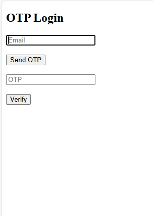

# OTP_BASED_LOGIN
#output
https://github.com/palakjain03/OTP_BASED_LOGIN/blob/main/output.png

# 🔐 OTP-Based Login System

## 📌 Project Description
This project implements an **OTP (One-Time Password) based login system** that allows users to authenticate using their **Email ID or Mobile Number**.  
It ensures secure authentication, OTP verification, resend functionality, and complete **audit logging** for tracking every action.

This system is designed as a **backend authentication service** following security and best practices.

---

## 🎯 Objective
To build a secure authentication system that:
- Uses OTP instead of passwords
- Supports email and mobile-based login
- Logs every API action for auditing purposes
- Prevents misuse using rate limits and attempt tracking

---

## ⚙️ Features

### ✅ Send OTP
- Accepts **email or mobile number**
- Validates input format
- Checks if user exists in database
- If user does not exist:
  - OTP is sent first
  - User record is created after OTP request
- OTP is generated securely and stored in **encrypted/hashed format**
- OTP is **not returned** in API response

---

### ✅ Verify OTP
- Accepts identifier (email/mobile) and OTP
- Validates OTP correctness and expiry
- Tracks failed attempts
- Blocks verification after maximum allowed attempts
- On successful verification:
  - OTP is marked as verified
  - User login is completed

---

### ✅ Resend OTP
- Allows OTP resend with cooldown time
- Rate-limited resend requests
- Generates a new OTP
- Invalidates the previous OTP
- Tracks resend count and OTP status

---

## 🧾 Audit Logging (Mandatory)
Every API request is logged in the database.

### Logged Details:
- API name
- Execution step
- Status (Success / Failure)
- Message
- Timestamp
- Unique Trace ID

These logs allow **complete auditing of OTP lifecycle and user activity**.

---

## 🗄️ Database Tables

### 👤 Users Table
- Stores user details (email/mobile)
- Created automatically for first-time users

### 🔑 OTP Requests Table
- OTP hash
- Expiry time
- Verification attempts
- Resend count
- OTP status (Pending, Verified, Expired, Blocked)

### 📊 Audit Logs Table
- API name
- Step
- Status
- Message
- Timestamp
- Trace ID

---

## 🔐 Security Measures
- OTP is never stored in plain text
- OTP expiration handling
- Maximum verification attempt limit
- Rate-limited OTP resend
- Complete request-level audit logging

---

## 🔄 Application Flow
1. User enters email or mobile number
2. OTP is generated and sent
3. User enters OTP
4. OTP is verified
5. Login success or failure is logged
6. Audit logs record every step

---

## 📦 Deliverables
- Source Code
- Database Schema / SQL Script
- API Documentation
- Sample OTP and Audit Log Data

---

## 🧪 Sample Output

---

## 🚀 Conclusion
This project demonstrates a **secure OTP-based authentication system** with strong emphasis on:
- Security
- Logging
- Scalability
- Backend best practices

---

## 👩‍💻 Author
**Palak Jain**
